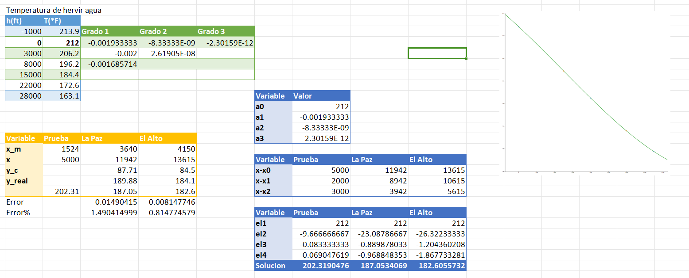

<h1 align='cente'>🌡️ Tempereratura de Ebullicion</h1>

    Por Luis Gabriel Coa Callisaya (<a href=https://github.com/RepolloDev''>@RepolloDev</a>)

Segun datos sacados de un libro, se tiene estimado
la temperatura de _ebullición_ del agua está dada
por la siguiente tabla que representa la relación
de altura y temperatura de ebullición.

| h [ft] | T [F] |
| ------ | ----- |
| -1000  | 213.9 |
| 0      | 212   |
| 3000   | 206.2 |
| 8000   | 196.2 |
| 15000  | 184.4 |
| 22000  | 172.6 |
| 28000  | 163.1 |

> [!CAUTION]
> Estos valores se encuentras en unidades de Pies (ft)
> y en Fahrenheit.

## 🎯 Objetivo

Con estos datos deseamos encontrar la temperatura
de ebullición para:

- 5000 Pies
- A la altura de la ciudad de La Paz (11942)
- A la altura de la cidudad de El Alto (13615)

> [!TIP]
> Para su calculo, se realizó una conversión
> de valores para trabajar con la tabla de datos

## 🧰 Proceso

Entonces, mediante estos datos se puede realizar
una interpolación, en este caso se realizará mediante

    

> [!NOTE]
> En este caso se utiliza un rango de valores
> pues no es necesario interpolar, dado que
> los valores son simples

| Variable | Valor real | Valor calculado | Error |
| -------- | ---------- | --------------- | ----- |
| Prueba   | x          | 202.32          | x     |
| La Paz   | 189.88     | 187.05          | 1.49% |
| El Alto  | 184.1      | 182.6           | 0.81% |

Utilizando los mismos valores pero ahora mediante
una interpolación de Lagrange tenemos los siguientes
datos.

| Variable | Valor real | Valor calculado | Error |
| -------- | ---------- | --------------- | ----- |
| Prueba   | x          | 202.18          | x     |
| La Paz   | 189.88     | 188.99          | 0.46% |
| El Alto  | 184.1      | 186.34          | 1.21% |

## 🏁 Conclusión

En conclusión, ambos métodos son muy buenos
para la interpolación de datos, pero para este
caso Lagrange es mejor respecto a Newton, pero
cabe remarcar que **únicamente de utilizaron datos cercanos**,
es decir, se usaron valores en un rango que contienen
a los que se deas interpolar.

> [!IMPORTANT]
> Dado que en ambos casos se usaron solo un rango de
> valores y no todos, probablemente al usar todos
> los datos Newton sea superior.
