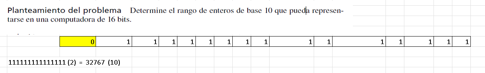
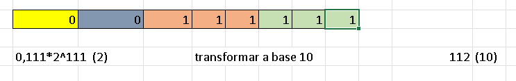

<h1 align='center'>Clase 3 - Representación binaria</h1>

Continuando con la clase anterior acerca de la representación de números decimales en base binaria, esto respecto a la forma en la que la computadora almacena valores en binario.

El número de _bits_ es el espacio de 1's y 0's, siguiendo la
formula de:

$$
m \times b^{n}
$$

Donde $m$ es el número original recorrido a la parte decimal, $b$ la base numérica del número y $n$ la cantidad de posiciones del número.

### 🎯 Ejemplo 1

Si tengo el número 123.123, entonces para convertirlo a la forma descrita lo recorremos.

$$
123.123 \rightarrow 0.123123
$$

Posteriormente le multiplicamos la base numérica del número original.

$$
0.123123 \times 10
$$

Finalmente, elevamos la cantidad de posiciones que recorrimos al número original, en este caso recorrimos 3 posiciones.

$$
0.123123 \times 10^3
$$

## 📷 Representación

La representación de un número en una computadora de _16 bits_ se ve de la siguiente manera, donde tenemos:

- El primer espacio representa el signo del número (0 -> +) (1 -> -)
- El segundo espacio representa el signo del exponente
- Los siguientes espacios son usados para representar al exponente
- Los últimos espacios son usados para representar a la mantiza (valor cambiado)

> En caso donde tenegamos un número exageradamente grande que **que no se pueda representar**, entonces se lo conoce como desbordamiento.

### 🎯 Ejemplo 1

Supongamos que tenemos el número más grande en un dispositivo con _8 bits_, donde tenemos la representación en la imagen adjunta.

$$
0.111 \times 2^{111}
$$

Para convertir este valor a base 10 simplemente convertimos la mantiza y el exponente a base decimal.

$$
0.111 \rightarrow \sum_{1}^{3}{2^{-i}} = 0.875
$$

$$
111 \rightarrow 7
$$

Entonces el resultado es

$$
0.875 \times 2^{7} = 112
$$

## 💥 Ejercicio

Comenzando con el error de la máquina es

$$
\epsilon = 2.22 \times 10^{-16}
$$

### Para equipos de 32 bits

Para equipos de 32 bits tenemos lo siguiente:

- 7 bits para el exponente
- 23 bits para la mantiza

Para el valor más pequeño tenemos:

- 0 en el signo del número
- 1 en el signo del exponente
- todos lo bits en el exponente
- el primer bit en la mantiza

$$
0.1 \times 2^{-1111} = 0.5 \times 2^{-256} = 4.3180842775472223 \times 2^{-78}
$$

Para el valor más grande tenemos:

- 0 en el signo del número
- 0 en el signo del exponente
- todos los bits en el exponente
- todos los bits en la mantiza

$$
0.11...1 \times 2^{11...1} = 0.9999997615814209 \times 2^{4194304}
$$

### Para equipos de 64 bits

Para equipos de 64 tenemos lo siguiente:

- 11 bits
- 52 bits

Para el valor más pequeño tenemos:

- 0 en el signo del número
- 1 en el signo del exponente
- todos lo bits en el exponente
- el primer bit en la mantiza

$$
0.1 \times 2^{-11...1} = 0.5 \times 2^{-}
$$